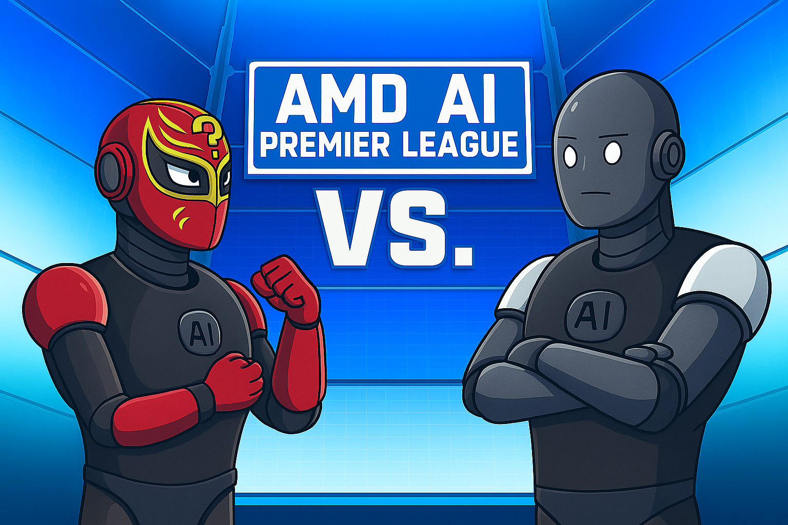

# 🏏 AMD AI Premier League (AAIPL) — Adversarial Agent Orchestration
### *High-Performance LLM Optimization & Reinforcement Learning on AMD Instinct™ MI300X*

<p align="center">
  
</p>

---

## 🧠 1. TEAM ALPHA1
The **AMD AI Premier League (AAIPL)** is a specialized competitive track hosted at the **IIT Delhi Yardi School of AI** during the AMD AI Reinforcement Learning Hackathon in February 2026. This implementation focuses on the development of a dual-agent ecosystem: a **Q-Agent** for adversarial question generation and an **A-Agent** for deductive reasoning, both specifically optimized for the **AMD Instinct™ MI300X** ecosystem.

In this "Cricket-style" tournament, models compete in head-to-head innings where performance is measured by an agent's ability to stump opponents with complex puzzles while accurately decoding adversarial inputs under strict latency constraints.

---

## 🤖 2. The Task: Dual-Agent Architecture
The core objective is to build and optimize two specialized agents designed to interact within an adversarial "Pitcher-Batter" loop:

### 2.1 The Question Agent (Q-Agent)
* **Objective:** Generate $N$ puzzle-based questions based on provided topics such as Syllogisms, Seating Arrangements, Blood Relations, and Alphanumeric Series.
* **Implementation:** Developed in `agents/question_model.py` and invoked by `agents/question_agent.py`.
* **Format Requirement:** Must output questions strictly in the schema specified in `sample_question.json`.

### 2.2 The Answer Agent (A-Agent)
* **Objective:** Solve adversarial questions posed by the opponent's Q-Agent.
* **Implementation:** Developed in `agents/answer_model.py` and invoked by `agents/answer_agent.py`.
* **Format Requirement:** Must output answers strictly in the schema specified in `sample_answer.json`.

---

## ⚙️ 3. Operational Instructions
1.  **Workstation Access:** Sign in to **dev.amd-ai-academy.com** using the assigned Team ID and Password.
2.  **Model Protocols:** Use only authorized models provided in `/root/.cache/huggingface/hub`.
3.  **Modification Rule:** Hub models are read-only; they must be **copied** into the `AAIPL/hf_models` folder for editing. Modifying the original folder results in immediate disqualification.
4.  **Synchronization:** Coordinate with team members to ensure simultaneous notebook edits do not overwrite work.
5.  **Submission:** Push all code (excluding `hf_models`) to GitHub using the `git.sh` script before the deadline.

---

## 🏟️ 4. Tournament Overview & Scoring
All matches are **1v1 knockout** format where two teams switch sides in a two-inning structure.

### 4.1 Innings Structure
* **1st Inning:** Team-A (Q-Agent) pitches $N$ questions $\rightarrow$ Team-B (A-Agent) solves.
* **2nd Inning:** Team-B (Q-Agent) pitches $N$ questions $\rightarrow$ Team-A (A-Agent) solves.

### 4.2 Scoring Criteria
Performance is measured by competitive accuracy using the following formulas:

$$\text{A-agent Score} = \dfrac{\text{Count of questions correctly answered in expected format}}{N} \times 100$$

$$\text{Q-agent Score} = \dfrac{\text{Count of questions incorrectly answered by opponent}}{N} \times 100$$

> **Format Integrity Rule:** Teams must maintain a minimum **50% format-correctness rate** to avoid automatic disqualification. In case of a **TIE**, closed benchmark questions are used to evaluate A-Agents.

---

## 📋 5. Guidelines
Only responses from the Q-Agent and A-Agent that strictly follow the JSON formats below will be considered for evaluation.

### 5.1 Q-Agent Format (Output Schema)
```json
{
    "topic": "<Topic of the Question>",
    "question": "<full question text>",
    "choices": [
        "A) <choice A text>",
        "B) <choice B text>",
        "C) <choice C text>",
        "D) <choice D text>"
    ],
    "answer": "<correct choice letter only>",
    "explanation": "brief explanation within 100 words"
}
```

### 5.2 A-Agent Format (Output Schema)
```json
{
    "answer": "<correct choice letter only>",
    "reasoning": "brief reasoning within 100 words"
}
```

---

## 🛠️ 6. Submission & Persistence
* **Workspace:** All work must be contained within the `AAIPL` folder.
* **Execution:** Agents are invoked via `python -m agents.question_agent` and `python -m agents.answer_agent`.
* **Persistence:** Inference results must be saved specifically to `outputs/questions.json` and `outputs/answers.json`.
* **Checkpoints:** Ensure model checkpoints (e.g., `.safetensors`, `.pt`) load correctly during automated evaluation.

---

## ⚠️ 7. Strict Restrictions
Failure to comply results in immediate disqualification:
* **No RAG:** Retrieval Augmented Generation is strictly prohibited.
* **Adversarial Integrity:** Strategies designed to force opponent "hallucinations" are disallowed.
* **Language:** Strictly English only for both agents.
* **Latency SLAs:** * **Question Generation:** Under **13 seconds** per question.
    * **Answer Generation:** Under **9 seconds** per answer.

---

## 📂 8. Directory Overview
```plaintext
.
├── agents/
│   ├── question_model.py      # Core Q-agent logic
│   ├── question_agent.py      # Inference driver for Q
│   ├── answer_model.py        # Core A-agent logic
│   └── answer_agent.py        # Inference driver for A
├── assets/
│   ├── topics.json            # Target topics for generation
│   ├── sample_question.json   # Q-format specification
│   └── sample_answer.json     # A-format specification
├── qgen.yaml / agen.yaml      # Generation parameters
└── README.md                  # Project Dashboard
```

---

## 🚀 9. Getting Started
To verify your system on the AMD Instinct™ MI300X workstation:

### Generate Questions
```bash
python -m agents.question_agent --output_file "outputs/questions.json" --num_questions 20 --verbose
```

### Evaluate Answers
```bash
python -m agents.answer_agent --input_file "outputs/filtered_questions.json" --output_file "outputs/answers.json" --verbose
```

---

## 🔬 Acknowledgments
Developed for the **AMD AI Reinforcement Learning Hackathon (Feb 2026)** at **IIT Delhi**. Special thanks to the **AMD Engineering Team** for MI300X compute access and **Unsloth** for performance optimization support.

```
